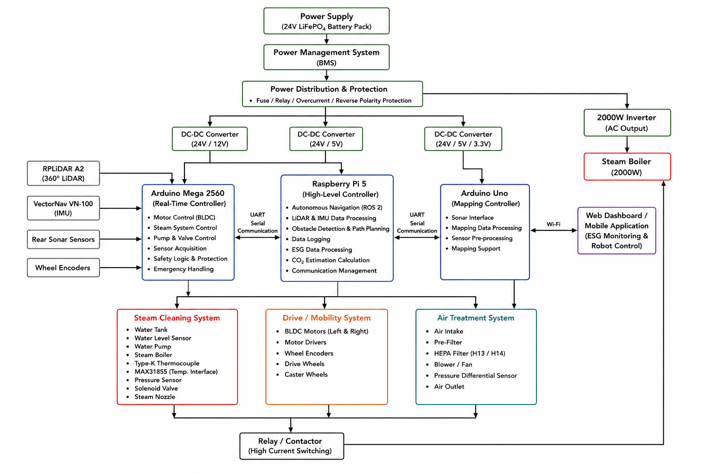
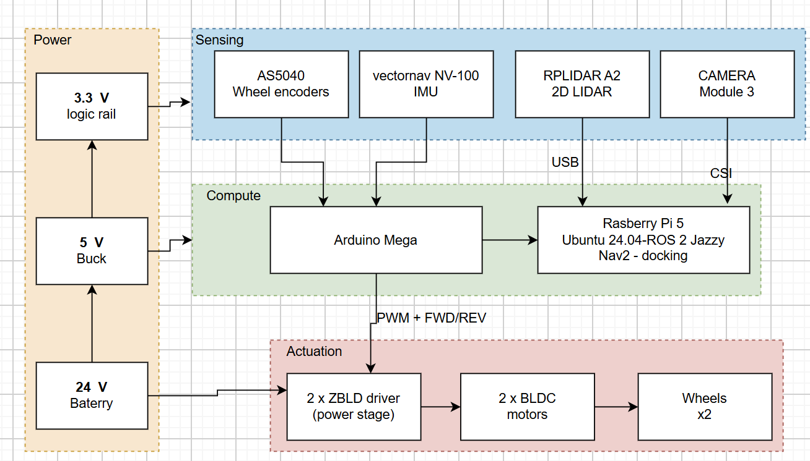

## Hardware

Hardware documentation for the Autonomous Steam Cleaning & Air Sterilization Robot: electrical wiring, power distribution, computing, sensors, motor control, the bill of materials, and safety notes.

Status: experimental / documentation-first. The electrical, BOM, safety, and now the mechanical CAD and datasheets are real and maintained.

